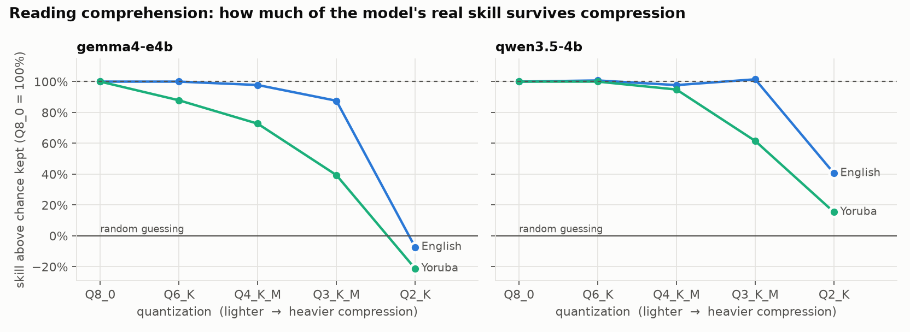
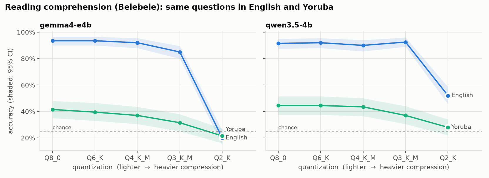
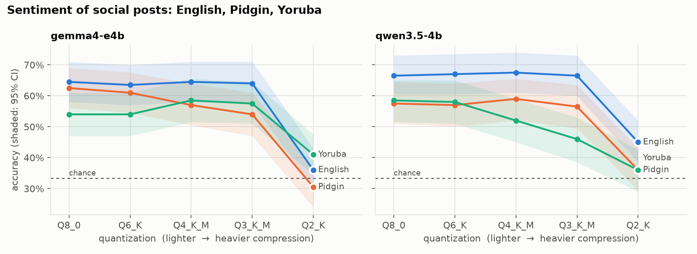
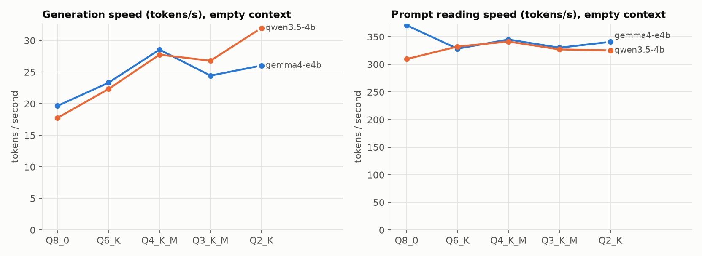
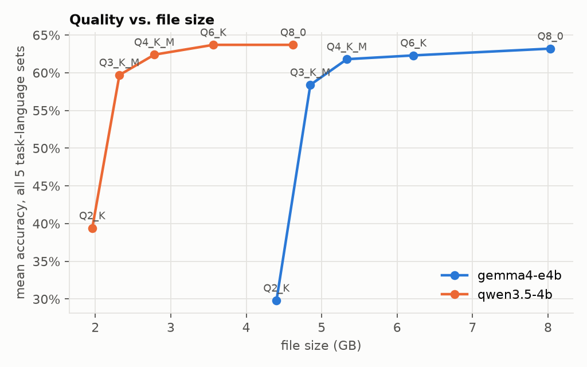

# Squeezing local LLMs: what compression costs in English, Pidgin and Yoruba

*A one-day benchmark on a 24 GB Apple M4 MacBook.*

## The question

Running an AI model on your own laptop means **quantizing** it: storing each of
its billions of weights in fewer bits (8, 6, 4, 3, even 2 instead of 16). The
file shrinks and replies get faster, but the model gets somewhat worse.

Most quantization benchmarks only measure English. This one asks:

1. **How much quality, speed and memory changes at each compression level on a normal Mac?**
2. **Does compression hurt Yoruba and Nigerian Pidgin more than English?**

## TL;DR

- **Q4_K_M is the sweet spot for English and Pidgin.** Compared with Q8_0, it
  generates **45–56% faster**, the file is **34–40% smaller**, and it uses **31–34% less GPU memory**. Neither model
  showed a significant quality loss on any English or Pidgin task.
- **Yoruba breaks first.** On reading comprehension (identical questions),
  English keeps **88–102%** of its above-chance skill at Q3_K_M. Yoruba keeps
  only **39–62%**. Gemma's Yoruba is already sliding at Q4 (73% kept).
- **The gap before compression is much bigger than the gap compression
  causes.** Both models score **~92% in English and ~43% in Yoruba** on the
  same questions. Small local models barely read written Yoruba, even
  uncompressed.
- **Yoruba also pays a "token tax".** The same passage costs **1.9–2.0× as many
  tokens** in Yoruba as in English, so it is slower to process and fills the
  context window faster. Pidgin costs the same as English.
- **Don't go below Q4 on a Mac.** Q3_K_M is no faster than Q4_K_M (on Gemma it is
  15% slower) and loses quality. Q2_K collapses: the models mostly repeat one answer letter.

## Results

### Reading comprehension: English vs. Yoruba



*Skill kept* = (accuracy − 25% chance) ÷ (Q8_0 accuracy − 25%). Raw accuracy
understates Yoruba's loss because Yoruba starts close to chance: dropping from
41.5% to 31.5% cuts what the model actually knows by more than half.



| Accuracy | Gemma 4 E4B, English | Gemma 4 E4B, Yoruba | Qwen 3.5 4B, English | Qwen 3.5 4B, Yoruba |
|---|---|---|---|---|
| Q8_0 | 93.5% | 41.5% | 91.5% | 44.5% |
| Q6_K | 93.5 | 39.5 | 92.0 | 44.5 |
| Q4_K_M | 92.0 | 37.0 | 90.0 | 43.5 |
| Q3_K_M | **85.0** ▼ | **31.5** ▼ | 92.5 | **37.0** ▼ |
| Q2_K | 20.0 ▼ | 21.5 ▼ | 52.0 ▼ | 28.0 ▼ |

▼ = significantly worse than the same model's Q8_0 on the same 200 questions
(exact McNemar test, p < 0.05).

### Sentiment: English, Pidgin, Yoruba



This is the noisier task (tweets with crowd labels, chance = 33%), and the
evidence is mixed:

- **Qwen:** Yoruba is the only language that degrades before Q2. It loses
  6.5 points at Q4 (p = 0.04) and 12.5 at Q3 (p = 0.007). English and Pidgin
  are flat.
- **Gemma:** Yoruba sentiment does *not* degrade; it scores slightly higher at
  Q4 and Q3, within noise. Pidgin drops 8.5 points at Q3 (p = 0.02).

So the "Yoruba breaks first" finding is solid for reading comprehension in both
models, and holds for sentiment in one of them.

### Speed and memory



| | Q8_0 | Q6_K | **Q4_K_M** | Q3_K_M | Q2_K |
|---|---|---|---|---|---|
| **Gemma 4 E4B**: generation tok/s | 19.7 | 23.3 | **28.6** | 24.4 | 26.0 |
| GPU memory (GB, 16k context) | 8.3 | 6.5 | **5.7** | 5.2 | 4.8 |
| **Qwen 3.5 4B**: generation tok/s | 17.8 | 22.3 | **27.8** | 26.8 | 32.0 |
| GPU memory (GB, 16k context) | 5.0 | 4.0 | **3.3** | 2.9 | 2.5 |

- **Generation** (writing the reply) is limited by how fast weights stream
  from memory, so smaller files are faster. The exception is Q3_K_M, likely
  because its 3-bit packing costs more compute to unpack than it saves in
  bandwidth.
- **Prompt reading** is compute-bound and stays at ~300–370 tok/s at every
  level. Compression doesn't make long prompts faster.
- With 4,096 tokens already in context, generation is only 0–8% slower.
- **Gemma E4B barely shrinks below Q4.** Its large per-layer embedding tables
  sit on the CPU and don't compress much: Q2_K is still 4.4 GB, versus 5.3 GB
  for Q4_K_M.



### Recommendation for the Telegram bot

- **English/Pidgin chat:** Qwen 3.5 4B **Q4_K_M**. It is 2.8 GB with ~28 tok/s
  replies and has no measurable loss vs. Q8_0. Gemma E4B Q4_K_M is equally
  fast and about as accurate, but needs 1.7× the memory (5.7 vs 3.3 GB).
- **If Yoruba matters:** Qwen 3.5 4B **Q6_K** (3.6 GB, ~22 tok/s, no measurable
  loss). Better still, don't rely on a 4B model for written Yoruba at all:
  ~44% on 4-choice questions is not usable.

Full tables, including CIs, paired tests, macro-F1 and token counts, are in
[`results/summary.md`](results/summary.md).

## Setup

| | |
|---|---|
| Machine | Apple M4 (10-core), 24 GB unified memory, macOS 27.0 |
| Runtime | llama.cpp build 7fe450e19 (Metal), via `llama-server` and `llama-bench` |
| Models | Gemma 4 E4B-it, Qwen 3.5 4B (both ~4B-class, instruction-tuned) |
| Quant levels | Q8_0 (reference), Q6_K, Q4_K_M, Q3_K_M, Q2_K |

**How the quantized files were made.** Q8_0 GGUFs were downloaded from
bartowski's Hugging Face repos (checksums verified). The lower levels were made
locally from Q8_0 with `llama-quantize` using plain K-quants (no importance
matrix). This gives one recipe for both models, and matches how the default
Ollama library files are made. Importance-matrix quants would likely score a
little higher at Q3/Q2.

### Tasks (200 items each, same items for every config)

| Task | Languages | Source |
|---|---|---|
| Reading comprehension, 4-choice | English, Yoruba (the *same* questions translated) | Belebele (`facebook/belebele`) |
| Sentiment (positive/negative/neutral), class-balanced | English, Nigerian Pidgin, Yoruba | TweetEval; AfriSenti (`masakhane/afrisenti`) |

- **Prompts:** instructions are always in English; only the passage or post
  changes language.
- **Decoding:** temperature 0. Output is grammar-constrained to a valid label,
  so scores measure knowledge, not formatting. Qwen's thinking mode is off.
- **Uncertainty:** accuracy comes with 95% bootstrap confidence intervals. With
  200 items, differences under about 5 points are within noise.

### Speed
`llama-bench`, 5 repetitions: prompt processing of 512 tokens (pp512) and
generation of 128 tokens (tg128), at empty context and with 4,096 tokens
already in context. Run with no other heavy processes.

## Reproduce

```sh
brew install llama.cpp
python3 -m venv .venv && .venv/bin/pip install -r requirements.txt
sh scripts/download.sh          # Q8_0 files + checksum check
sh scripts/run_all.sh           # evals, quantize, quality, speed, report
```

| Script | Does |
|---|---|
| `scripts/build_evals.py` | builds the fixed 1,000-item eval set in `data/evals.jsonl` |
| `scripts/quantize.py` | Q8_0 → Q6_K / Q4_K_M / Q3_K_M / Q2_K |
| `scripts/bench_quality.py` | runs every item through every config, records memory |
| `scripts/bench_speed.py` | llama-bench sweep |
| `scripts/report.py` | tables (`results/summary.md`) and charts (`results/*.png`) |

## Limitations

- Two models, both ~4B. Bigger models may degrade differently.
- 200 items per task-language set; small differences are noise.
- AfriSenti labels come from tweets and are noisy. Treat the sentiment
  accuracies as relative (quant vs. quant), not absolute.
- Belebele's correct answers are not perfectly balanced across A–D in this
  sample (C is most common, at 31%).
- The quality runs used 4 parallel server slots. This barely affects results
  at temperature 0, but is not bit-for-bit identical to single-request runs.
- 40 paired tests were run, so about 2 "significant" results at p < 0.05
  could be flukes. The borderline ones (p ≈ 0.02–0.04) should be read together
  with the consistent direction across models, not on their own.
- At Q2_K, scores near or below chance come from the model repeating one
  letter (Gemma answers "A" 77% of the time). They measure collapse, not
  comprehension.
- Memory is llama.cpp's own GPU accounting (weights + KV cache + scratch).
  macOS process RSS was also recorded but is unreliable for Metal and
  memory-mapped models (it *rose* as files shrank), so it isn't reported.
- Speed is from a single machine and a single llama.cpp build (`7fe450e19`,
  macOS 27.0). Q3_K being slower than Q4_K reflects this build's Metal
  kernels, and may change.
- Setup notes: downloads came from bartowski's Hugging Face repos, and the
  quality results use the bartowski Q8_0 as the reference for each model.
