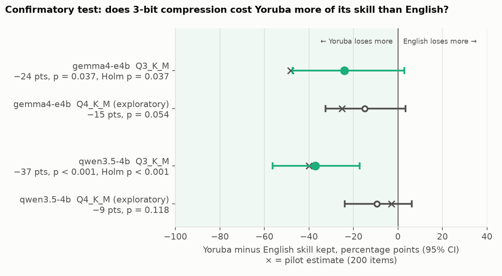

# Squeezing local LLMs: what compression costs in English, Pidgin and Yoruba

*A one-day benchmark on a 24 GB Apple M4 MacBook.*

## The question

Running an AI model on your own laptop means **quantizing** it: storing each of
its billions of weights in fewer bits (8, 6, 4, 3, even 2 instead of 16). The
file shrinks and replies get faster, but the model gets somewhat worse.

Most quantization benchmarks only measure English. This one asks:

1. **How much quality, speed and memory changes at each compression level on a normal Mac?**
2. **Does compression hurt Yoruba and Nigerian Pidgin more than English?**

## Glossary

- **Q8_0, Q6_K, Q4_K_M, Q3_K_M, Q2_K**: compression levels in llama.cpp. The
  number is roughly the bits stored per weight: lower means smaller and faster,
  but less accurate. Q8_0 is near-lossless and is the reference here.
- **Above-chance skill**: how far a score sits above random guessing (25% on
  4-choice questions, 33% on 3-way sentiment). **Skill kept** is the share of
  that margin that survives compression.
- **Token**: the chunk of text a model reads and writes, often a piece of a word.
- **tok/s**: tokens per second. Generation tok/s is how fast a reply appears.
- **Context**: the text the model holds at once (prompt plus conversation),
  measured in tokens.
- **File size vs. GPU memory**: the model file on disk, vs. what it occupies
  while running, including working memory for the context.

## TL;DR

- **Q4_K_M is the sweet spot for English and Pidgin.** Replies come about 1.5×
  faster than at Q8_0 and use about a third less memory, with no measurable
  quality loss.
- **Yoruba breaks first.** At 3-bit compression (Q3_K_M), Yoruba keeps about
  60% of its reading skill, while English keeps 86% (Gemma) to 98% (Qwen). A
  pre-registered test on 573 new questions supported this for both models: for
  Qwen clearly, for Gemma only narrowly. The gap is smaller than the first run
  suggested: 24–37 points, not 40–48.
- **The bigger problem comes before compression.** Both models answer about 9 in
  10 English reading questions correctly, but fewer than half of the same
  questions in Yoruba.
- **Yoruba costs 2.4–2.6 times as many tokens** as English for the same
  passage, so it is slower to process and fills the model's context faster.
- **Don't go below Q4_K_M on a Mac.** Q3_K_M is no faster and starts losing
  quality, especially in Yoruba. Q2_K badly damages both models; Gemma
  collapses into guessing.

## Results

### Reading comprehension: English vs. Yoruba

**At Q3_K_M, Yoruba loses more of its reading skill than English in both
models.** A pre-registered test on 573 new questions supports this
([Confirmatory test](#confirmatory-test)). The tables below are the first,
200-question run (the pilot). Its Yoruba-vs-English gap estimates are affected
by a question-pairing error, described in the confirmatory section.


Error bars are 95% confidence intervals. Yoruba's bars are wide because it
starts close to chance, so a few questions swing the ratio a lot. Values below
0 (shaded) mean worse than random guessing.

| Skill kept (95% CI) | Gemma, English | Gemma, Yoruba | Qwen, English | Qwen, Yoruba |
|---|---|---|---|---|
| Q6_K | 100% (98 to 102) | 88% (67 to 109) | 101% (100 to 102) | 100% (83 to 121) |
| Q4_K_M | 98% (94 to 101) | 73% (41 to 104) | 98% (93 to 102) | 95% (71 to 125) |
| Q3_K_M | 88% (81 to 94) | 39% (0 to 86) | 102% (96 to 107) | 62% (31 to 95) |
| Q2_K | −7% (−15 to +1) | −21% (−65 to +15) | 41% (30 to 50) | 15% (−17 to +50) |

**How much more did Yoruba lose than English?** This is Yoruba's skill kept
minus English's, in percentage points (negative = Yoruba lost more). Pilot
only. Because of the pairing error, these mostly compare different English and
Yoruba questions, so the intervals are unreliable. See the
[confirmatory test](#confirmatory-test) for the corrected result.

| Gap (95% CI) | Q6_K | Q4_K_M | Q3_K_M | Q2_K |
|---|---|---|---|---|
| Gemma 4 E4B | −12 (−34 to +9) | −25 (−57 to +6) | **−48 (−86 to −1)** | −14 (−57 to +24) |
| Qwen 3.5 4B | −1 (−17 to +20) | −3 (−28 to +27) | **−40 (−70 to −8)** | −25 (−58 to +10) |

The raw accuracies behind these figures:


| Accuracy | Gemma 4 E4B, English | Gemma 4 E4B, Yoruba | Qwen 3.5 4B, English | Qwen 3.5 4B, Yoruba |
|---|---|---|---|---|
| Q8_0 | 93.5% | 41.5% | 91.5% | 44.5% |
| Q6_K | 93.5 | 39.5 | 92.0 | 44.5 |
| Q4_K_M | 92.0 | 37.0 | 90.0 | 43.5 |
| Q3_K_M | **85.0** ▼ | 31.5 ▽ | 92.5 | 37.0 ▽ |
| Q2_K | 20.0 ▼ | 21.5 ▼ | 52.0 ▼ | 28.0 ▼ |

Symbols mark drops vs. the same model's Q8_0 ([Methods](#statistics)):
- **▼** = reliable: it holds up after correcting for the number of tests run.
- **▽** = significant only before that correction.

At Q2_K, below-chance scores come from the model repeating one letter. For
example, Gemma answers "A" 77% of the time.

### Confirmatory test

**On 573 new questions per language, the pre-registered test supports the
finding for both models: at Q3_K_M, Yoruba loses a larger share of its skill
than English.** For Qwen the result is clear. For Gemma it passes the decision
rule only narrowly.

- **Pre-registration:** the hypothesis, test, decision rule and analysis code
  were committed in [`PREREG.md`](PREREG.md), commit
  [`d342162`](https://github.com/sforslime/quant-bench/commit/d34216299a40cbdc9419e072022a484456fa4c76),
  before any model was run on these questions.
  The pre-registration commit was pushed to GitHub together with the results,
  so its timestamp is self-reported.
- **Questions:** the 573 Belebele questions not used above, in either language.
- **Rest of the setup:** unchanged from the first run (models, quant files,
  prompts and settings).



**Primary test, at Q3_K_M.** Gap = Yoruba's skill kept minus English's
(negative = Yoruba lost more). The p-values are one-sided, Holm-adjusted across
the two models. The rule: supported if the adjusted p < 0.05.

| | Skill kept, English | Skill kept, Yoruba | Gap (95% CI) | Holm p | Result |
|---|---|---|---|---|---|
| Gemma 4 E4B | 86% | 62% | −24 pts (−47 to +3) | 0.037 | **supported** (narrowly) |
| Qwen 3.5 4B | 98% | 61% | −37 pts (−56 to −17) | 0.001 | **supported** |

- **Gemma passes the one-sided test, but its two-sided 95% interval still
  reaches +3.** A one-sided test at 0.05 corresponds to a 90% interval, so both
  statements hold. Gemma's result is at the edge; Qwen's is not.
- **The gaps are smaller than in the first run** (−24 vs. −48 for Gemma, −37
  vs. −40 for Qwen). The first run's estimate was picked out because it looked
  large, so some shrinkage was expected.
- **At Q4_K_M (exploratory, not part of the test):** Yoruba again kept less
  than English, by −15 points for Gemma and −9 for Qwen. Neither interval
  excludes zero.

**Accuracy on the new questions:**

| Accuracy | Gemma, English | Gemma, Yoruba | Qwen, English | Qwen, Yoruba |
|---|---|---|---|---|
| Q8_0 | 91.6% | 40.1% | 89.4% | 42.9% |
| Q4_K_M | 90.1 | 37.5 | 87.3 | 40.7 |
| Q3_K_M | 82.4 | 34.4 | 88.1 | 36.0 |

**A correction to the first run.** Belebele's English and Yoruba files do not
list the questions in the same row order: only the first 178 rows line up.

- **In the first run:** languages were matched by row number, so only 42 of the
  200 English/Yoruba pairs were the same question.
- **Unaffected:** each language's accuracy, skill kept and paired quant
  comparisons.
- **Affected:** the claim that both languages used the *same* questions. Also
  the "paired" Yoruba-minus-English intervals (in effect they treated the two
  languages as independent samples) and the token-tax passage comparison.
- **Kept as is:** the results above are left unchanged as the pilot.
- **How the confirmatory test handles it:** it pairs questions by Belebele's
  own question key.

Full tables are in [`results/confirm/summary.md`](results/confirm/summary.md).
To rebuild them from the committed per-item results, run
`python scripts/confirm_report.py`. To re-run the test from scratch, run
`python scripts/build_confirm.py` then `python scripts/bench_confirm.py`.

### Sentiment: English, Pidgin, Yoruba

**Sentiment tells a messier story.** Yoruba slips under compression in Qwen but
not in Gemma, and none of the changes above Q2_K is statistically reliable.


- **Qwen:** Yoruba is the only language that trends down before Q2. It loses
  6.5 points at Q4_K_M and 12.5 at Q3_K_M. English and Pidgin are flat.
- **Gemma:** Yoruba doesn't degrade; it scores slightly higher at Q4_K_M and
  Q3_K_M, within noise. Pidgin drops 8.5 points at Q3_K_M.

This is the noisier task: the tweets carry crowd-sourced labels, and chance is
33%. Treat the scores as relative (one quant vs. another), not absolute.

### Speed and memory

**Q4_K_M gives the best trade-off: roughly 1.5× faster generation than Q8_0,
with a third less memory.** Going smaller doesn't help, because Q3_K_M is no
faster.


| | Q8_0 | Q6_K | **Q4_K_M** | Q3_K_M | Q2_K |
|---|---|---|---|---|---|
| **Gemma 4 E4B**: generation, tok/s | 19.7 | 23.3 | **28.6** | 24.4 | 26.0 |
| File size, GB | 8.0 | 6.2 | **5.3** | 4.9 | 4.4 |
| GPU memory, GB (at 16k context) | 8.3 | 6.5 | **5.7** | 5.2 | 4.8 |
| **Qwen 3.5 4B**: generation, tok/s | 17.8 | 22.3 | **27.8** | 26.8 | 32.0 |
| File size, GB | 4.6 | 3.6 | **2.8** | 2.3 | 2.0 |
| GPU memory, GB (at 16k context) | 5.0 | 4.0 | **3.3** | 2.9 | 2.5 |

At Q4_K_M vs. Q8_0, generation is 45–56% faster, the file is 34–40% smaller,
and GPU memory is 31–34% lower.

- **Generation** (writing the reply) is limited by how fast weights stream from
  memory, so smaller files are faster. The exception is Q3_K_M, likely because
  its 3-bit packing costs more compute to unpack than it saves in bandwidth. On
  Gemma it is 15% slower than Q4_K_M.
- **Prompt reading** is compute-bound and stays at ~300–370 tok/s at every
  level. Compression doesn't make long prompts faster.
- With 4,096 tokens already in context, generation is only 0–8% slower.
- **Gemma E4B barely shrinks below Q4_K_M.** Its large per-layer embedding
  tables sit on the CPU and don't compress much. The Q2_K file is still 4.4 GB,
  versus 5.3 GB for Q4_K_M.


### Token tax

**The same passage costs 2.4–2.6 times as many tokens in Yoruba as in
English**, even though the Yoruba text is slightly shorter.

| | English passage | Yoruba passage | Yoruba ÷ English | Full prompt, Yoruba ÷ English |
|---|---|---|---|---|
| Gemma 4 E4B | 97.1 tokens | 233.8 tokens | **2.41×** | 1.92× |
| Qwen 3.5 4B | 98.2 tokens | 259.0 tokens | **2.64×** | 2.07× |

These figures come from 421 correctly paired passages in the confirmatory set.
The pilot's figures (2.35× and 2.57×) were not correctly paired and are
superseded.

The Yoruba passages average 460 characters, versus 477 for English, so the tax
comes from tokenization, not from longer text. The likely cause (not measured
here) is that tone-marked characters (ẹ, ọ, ṣ, à, é, …) are rare in the
tokenizers' training data, so each one splits into several tokens. The "full
prompt" column includes the shared English instructions, which dilute the
ratio. See [Methods](#token-tax-method) for how this was measured.

### Recommendation for the Telegram bot

- **English/Pidgin chat:** Qwen 3.5 4B **Q4_K_M**.
  - Qwen: 2.8 GB file, 3.3 GB of GPU memory at 16k context, ~28 tok/s, with no
    measurable loss vs. Q8_0.
  - Gemma E4B Q4_K_M is equally fast and about as accurate, but it is a 5.3 GB
    file and needs 5.7 GB of GPU memory (1.7× Qwen).
- **If Yoruba matters:** Qwen 3.5 4B **Q6_K**.
  - 3.6 GB file, 4.0 GB of GPU memory, ~22 tok/s, with no measurable loss.
  - Better still, don't rely on a 4B model for written Yoruba at all: ~44% on
    4-choice questions is not usable.

Every number is in [`results/summary.md`](results/summary.md) and
[`results/confirm/summary.md`](results/confirm/summary.md). The corrected token
counts are in [`results/confirm/token_tax.json`](results/confirm/token_tax.json).

## Methods

### Setup

| | |
|---|---|
| Machine | Apple M4 (10-core), 24 GB unified memory, macOS 27.0 |
| Runtime | llama.cpp build 7fe450e19 (Metal), via `llama-server` and `llama-bench` |
| Models | Gemma 4 E4B-it, Qwen 3.5 4B (both ~4B-class, instruction-tuned) |
| Quant levels | Q8_0 (reference), Q6_K, Q4_K_M, Q3_K_M, Q2_K |

**The reference is Q8_0, not full precision (BF16).** Q8_0 is near-lossless in
practice, but not identical. "Skill kept" and "change vs. Q8_0" are relative to
Q8_0, so they slightly *understate* the total loss from full precision.

**How the quantized files were made.**
- Q8_0 GGUFs were downloaded from bartowski's Hugging Face repos, and their
  SHA-256 checksums were verified against the published values.
- The lower levels were made locally from Q8_0 with `llama-quantize`, using
  plain K-quants (no importance matrix).
- This gives one recipe for both models, and matches how the default Ollama
  library files are made.
- Importance-matrix quants would likely score a little higher at Q3_K_M and Q2_K.

### Tasks and scoring

200 items per task and language, with the same items for every config. The
confirmatory Belebele test adds 573 more questions per language
([Confirmatory test](#confirmatory-test)).

| Task | Languages | Source |
|---|---|---|
| Reading comprehension, 4-choice | English, Yoruba (pilot: 200 each, mostly different questions; confirmatory: 573 matched pairs) | Belebele (`facebook/belebele`) |
| Sentiment (positive/negative/neutral), class-balanced | English, Nigerian Pidgin, Yoruba | TweetEval (`cardiffnlp/tweet_eval`); AfriSenti (`masakhane/afrisenti`) |

- **Prompts:** instructions are always in English; only the passage or post
  changes language.
- **Decoding:** temperature 0, with output grammar-constrained to a valid
  label, so scores measure knowledge, not formatting. Qwen's thinking mode is off.

### Statistics

- **Accuracy CIs:** 95% bootstrap over items. With 200 items, a single
  accuracy is uncertain by roughly ±4–7 points (±4 near 90%, ±7 near 50%).
- **Paired test (McNemar):** each quant is compared with the same model's Q8_0
  on the same items. Each item is either right or wrong under both quants, so
  the exact McNemar test compares only the items where they disagree. It is
  paired, and much more sensitive than comparing two separate accuracies.
- **Multiple comparisons (Holm):** 40 paired tests were run (2 models × 4
  quants × 5 task-language sets), and p-values were adjusted with Holm's
  step-down correction.
  - Survivors: every Q2_K drop except Gemma's Yoruba sentiment, plus Gemma's
    Q3_K_M English reading drop.
  - No Yoruba-specific drop above Q2_K survives.
  - In sentiment:

    | Drop | Raw p | Holm p |
    |---|---|---|
    | Qwen Yoruba, Q4_K_M | 0.04 | 1.0 |
    | Qwen Yoruba, Q3_K_M | 0.007 | 0.20 |
    | Gemma Pidgin, Q3_K_M | 0.02 | 0.60 |

  - Raw and adjusted p-values for all 40 tests are in `results/summary.md`.
- **Skill kept CIs (paired bootstrap):** the 200 question IDs are resampled
  2,000 times. Each resample computes (acc_quant − chance) ÷ (acc_Q8_0 −
  chance), using the same questions for both quants. Yoruba's intervals are
  wide because Q8_0 starts only 16.5 (Gemma) and 19.5 (Qwen) points above
  chance.
- **Yoruba-minus-English gap:** intended to be paired by question, but the
  pilot matched languages by row number, which pairs the right question only 42
  of 200 times. The confirmatory test pairs by Belebele's own question key.
  - **Caveat:** this analysis was added after seeing the results, and its 8
    intervals are not corrected for multiple comparisons.
  - Its Q3_K_M intervals exclude zero for both models, and Gemma's only barely.
  - It was a hypothesis to confirm, not a finding; see
    [Confirmatory test](#confirmatory-test).

### Sanity check

Neither model's publisher reports Belebele:
- The [Gemma 4 technical report](https://arxiv.org/abs/2607.02770) doesn't include it.
- The [Qwen 3.5 4B model card](https://huggingface.co/Qwen/Qwen3.5-4B) lists
  other multilingual benchmarks (MMMLU, MMLU-ProX, INCLUDE, …).

As a plausibility check, the [Belebele paper](https://arxiv.org/abs/2308.16884)
(appendix tables) reports:

| Model | Setup | English | Yoruba |
|---|---|---|---|
| GPT-3.5-turbo | zero-shot | 87.7% | 29.1% |
| Llama 2 70B | five-shot | 90.9% | 28.3% |

Our Q8_0 scores are somewhat above those on English (91.5–93.5%, up to about
6 points higher) and well above on Yoruba (41.5–44.5%, 12–16 points higher).
Newer models doing better is plausible, but the setups differ (prompt format,
shots, answer extraction), so this is not a like-for-like comparison, and the
Yoruba gain in particular isn't explained by this benchmark alone.

### Speed

`llama-bench`, 5 repetitions:
- prompt processing of 512 tokens (pp512)
- generation of 128 tokens (tg128)

Both were measured at empty context and with 4,096 tokens already in context,
with no other heavy processes running.

### Memory

*File size* is the GGUF on disk. *GPU memory* is llama.cpp's own accounting of
weights + KV cache + compute scratch on the GPU, at a 16,384-token context
(4 slots × 4,096). macOS process RSS was also recorded, but it is unreliable
for Metal and memory-mapped models (it *rose* as files shrank), so it isn't
reported.

### Token tax method

- **Tokenizer:** each model's own tokenizer, via llama-server's `/tokenize` on
  the Q8_0 file. The tokenizer is identical across quants.
- **Text:** the **421 unique Belebele passages** in the confirmatory set,
  paired by Belebele's own question key (`scripts/token_tax.py --confirm`).
  Only the passages are counted, with special tokens excluded
  ([`scripts/token_tax.py`](scripts/token_tax.py)).
- **Pilot figures superseded:** the first run's count, over 182 pilot passages
  in `results/token_tax.json`, matched the languages by row number, so most of
  its pairs were not translations of each other.
- **Sentiment excluded:** the sentiment sets are different tweets in each
  language, not translations, so they can't be compared this way.

## Data and reproducibility

- **Eval set:** built by `scripts/build_evals.py` with seed `42` from pinned
  dataset versions (Hugging Face commit SHAs in the script). SHA-256 of
  `data/evals.jsonl`:
  `3594026aa65ecfc5ebd980ae275019e898cc4dd59005d40c7c63fcd0d76a4786`.
  Rebuilding reproduces this hash exactly.
- **Confirmatory set:** built by `scripts/build_confirm.py` from the same
  pinned Belebele revision, with no sampling.
  - `data/confirm.jsonl` holds 573 × 2 items. SHA-256:
    `9f58ea6abf742db28441ed7358a6b889b2fc671d0f871655c76e6099fc68f27b`
    (as recorded in [`PREREG.md`](PREREG.md)).
  - It isn't committed, because it contains dataset text. Rebuilding
    reproduces it byte for byte.
- **Per-item results are committed:**
  - `results/quality/<model>__<quant>.jsonl` has one line per question: item
    ID, gold label, prediction, correct or not, prompt tokens and latency.
  - `<model>__<quant>.meta.json` holds that config's memory and timing.
  - `results/speed.jsonl` holds the raw llama-bench numbers.
  - `results/confirm/<model>__<quant>.jsonl` has the confirmatory run, in the
    same format plus `pair` (the shared question number).
  - `results/confirm/token_tax.json` holds the corrected tokenizer counts,
    for both the passages and the full prompts; `results/token_tax.json` holds
    the superseded pilot counts.
- **Re-running the analysis needs no models:** `python scripts/report.py`
  (pilot) and `python scripts/confirm_report.py` (confirmatory test) regenerate
  every table and chart from the committed files.

### Reproduce from scratch

```sh
brew install llama.cpp
python3 -m venv .venv && .venv/bin/pip install -r requirements.txt
sh scripts/download.sh          # Q8_0 files + checksum check
sh scripts/run_all.sh           # evals, quantize, quality, speed, token tax, report
```

| Script | Does |
|---|---|
| `scripts/build_evals.py` | builds the fixed 1,000-item eval set in `data/evals.jsonl` |
| `scripts/quantize.py` | Q8_0 → Q6_K / Q4_K_M / Q3_K_M / Q2_K |
| `scripts/bench_quality.py` | runs every item through every config, records GPU memory |
| `scripts/bench_speed.py` | llama-bench sweep |
| `scripts/token_tax.py` | English vs. Yoruba token counts (`--confirm`: on the correctly paired passages) |
| `scripts/report.py` | tables (`results/summary.md`) and charts (`results/*.png`) |
| `scripts/build_confirm.py` | builds the held-out confirmatory set in `data/confirm.jsonl` |
| `scripts/prereg_power.py` | expected CI width and power of the confirmatory test, from the pilot |
| `scripts/bench_confirm.py` | runs the confirmatory set at Q8_0 / Q4_K_M / Q3_K_M (resumable) |
| `scripts/confirm_report.py` | pre-registered analysis (`results/confirm/summary.md`, `gap.png`) |

## Limitations

- **English-only instructions.** The instructions are in English, so the Yoruba
  tasks are partly cross-lingual. Some of the English–Yoruba gap may come from
  the setup rather than from Yoruba reading ability.
- **Sample size.** The pilot used 200 items per set; only Gemma's Q3_K_M
  English drop and all but one Q2_K drop survive multiple-test correction. The
  main Yoruba result rests on the 573-question confirmatory test, where Gemma
  passes only narrowly.
- **Reference.** Q8_0 is the reference, not BF16.
- **Model coverage.** Two models, both ~4B. Bigger models may degrade differently.
- **Sentiment labels.** AfriSenti labels come from tweets and are noisy.
- **Answer balance.** Belebele's correct answers are not perfectly balanced
  across A–D in the pilot sample (C is most common, at 31%).
- **Parallel slots.** The quality runs used 4 parallel server slots. This
  barely affects results at temperature 0, but is not bit-for-bit identical to
  single-request runs.
- **Speed.** Speed comes from a single machine and a single llama.cpp build.
  Q3_K being slower than Q4_K reflects this build's Metal kernels, and may change.

## Next steps

- ~~Confirm the Yoruba-vs-English gap with a pre-registered test.~~ Done; see
  [Confirmatory test](#confirmatory-test).
- Add a **Yoruba-instructions** variant to separate reading ability from the
  cross-lingual setup.
- Compare against **importance-matrix quants** and a **BF16** reference.

## License

The code is MIT-licensed (see [LICENSE](LICENSE)). The datasets keep their own
licenses, per their Hugging Face cards:
- Belebele: CC BY-SA 4.0
- AfriSenti (`masakhane/afrisenti`): CC BY-NC-SA 2.0
- TweetEval: listed as "unknown"

This repo does not redistribute dataset text. The result files contain only
item IDs, gold labels and model predictions.

## References

- Bandarkar et al. (2023). *The Belebele Benchmark: a Parallel Reading
  Comprehension Dataset in 122 Language Variants.* [arXiv:2308.16884](https://arxiv.org/abs/2308.16884)
- Muhammad et al. (2023). *AfriSenti: A Twitter Sentiment Analysis Benchmark
  for African Languages.*
- Barbieri et al. (2020). *TweetEval: Unified Benchmark and Comparative
  Evaluation for Tweet Classification.*
